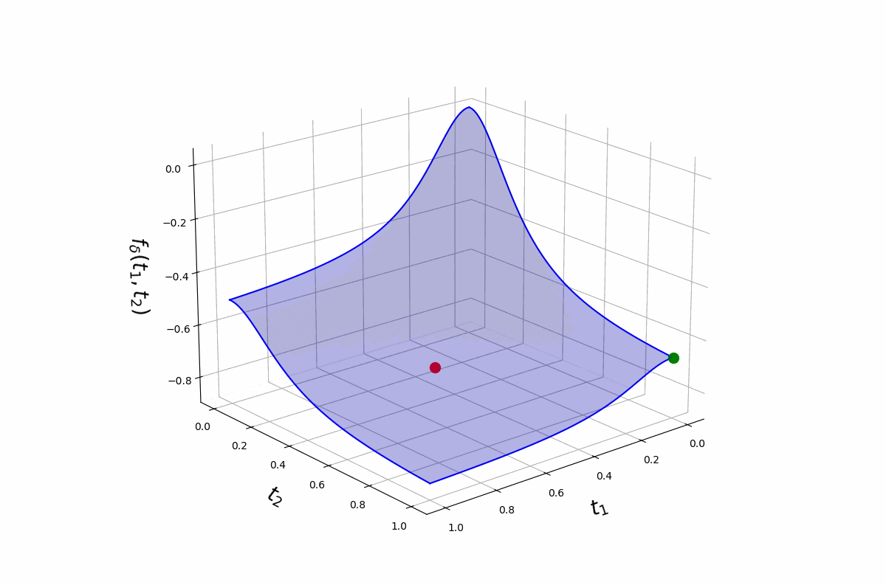
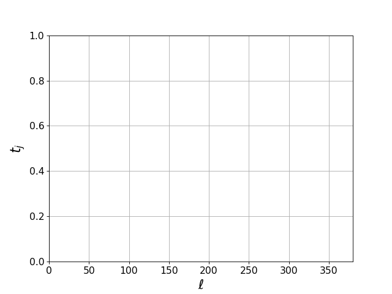

This repository provides a Python implementation of our method Grid-FW proposed in [arXiv paper](https://arxiv.org/abs/2505.10099). It also provides Julia code used for executing the Big-M approach using CPLEX to compare our method. 

# Sparse Minimum-Variance Portfolio Selection

The minimum-variance optimization yields dense portfolios, assigning nonzero weights to all assets. In many applications, some weights may be very small, and ideally such assets should be excluded to avoid transaction costs. The **sparse portfolio selection** problem enforces a constraint on the number of selected assets by formulating the problem as:

$$
\begin{aligned}
\min_{\beta \in \mathbb{R}^p} & \quad \beta^\top \Sigma \beta \\
\text{s.t.} & \quad 1^\top \beta = 1, \quad &#x2016\beta&#x2016_0 \leq k
\end{aligned}
$$

where:
- $\beta \in \mathbb{R}^p$ is the portfolio weight vector
- $\Sigma \in \mathbb{R}^{p \times p}$ is the asset covariance matrix
- &#x2016;β&#x2016;<sub>0</sub> counts the number of non-zero elements (the $\ell_0$-"norm")
- $k \geq 1$ is the sparsity constraint (maximum number of assets to include)

This problem is NP-hard: exhaustive search over all $\binom{p}{k}$ asset subsets becomes infeasible even for moderate $p$ and $k$. A common exact approach reformulates it as a Big-M mixed‐integer program and applies branch-and-bound solvers (e.g., CPLEX, Gurobi), but despite dramatic speedups over brute force, optimality gurantees of these methods can still require hours or days.

In time-constrained settings, we terminate <span style="font-family:monospace">CPLEX</span>  or <span style="font-family:monospace">Gurobi</span> after a preset time limit, yielding the best incumbent solution without optimality guarantees. This leads to our goal:

<table align="center">
  <tr>
    <td align="center" style="border:2px solid #0366d6; padding:15px; border-radius:8px; background:#f6f8fa;">
      <div style="font-size:1.1em; font-family:CMU Serif, Latin Modern, serif;">
        Develop a method that provides a better solution than these commericial solvers when time is constrained.
      </div>
    </td>
  </tr>
</table>

Our approach guarantees optimality in theory, and in practice its Frank–Wolfe–based implementation runs efficiently to produce high-quality approximate solutions.


# Grid-FW
#### A Scalable Gradient-Based Optimization Framework for Sparse Minimum-Variance Portfolio Selection

**Grid-FW** is a gradient-based approach that transforms the NP-hard combinatorial sparse portfolio selection problem into a constrained continuous optimization task via Boolean relaxation, while preserving equivalence with the original problem on the set of binary points. This algorithm employs a tunable parameter $\delta > 0$ that transmutes the auxiliary objective function from convex to concave as it increases. This allows a stable starting point, followed by a controlled path toward a sparse binary solution as $\delta$ increases and the objective moves toward concavity. 

In practice, our method matches commercial solvers in asset selection for most instances and, in rare instances, the solution differs by a few assets whilst showing a negligible error in portfolio variance. 

Following is an illustration of our method for simple 2-dimensional example when $k =1$ (i.e., select one optimal assert from p = 2 asserts). Observe that as $\delta$ increasing, the surface of the objective function is transforming towards concavity. 

<div align="center">
	
</div>

<br/>
<br/>

For a dataset of p = 31 assets in the [data/example1](./data/example1/) folder, the figure below shows how the values of `t_j` converge to the (optimal) binary vector with indices of ones in the vector correspond to the optimal assets for `k = 4`. Here, ℓ denotes the iteration number.


<div align="center">
	
</div>


# Python Dependencies (Grid-FW)
```
Python >= 3.12.2
Numpy >= 2.2.4
Pandas >= 2.2.3
SciPy >= 1.14.1
```
# Julia Dependencies (CPLEX)
```
JuMP >= 0.22.3
CPLEX >= 0.8.1
Julia >= 1.2
```

# Download Instructions
Download this repository and extract into a folder, which will contain:

```
data            : contains all the datasets used in our applications
results.xlsx    : Excel file with all experiment results (Table 2 of the paper)
portfolio.py    : functions required to execute the Grid-FW algorithm
main.py         : imports portfolio.py and runs the algorithm
table1.py       : run this to obtain the results of Table 1 in the paper
example1.py     : run this to get Grid-FW results for Example 1 in Table 2
example2.py     : run this to get Grid-FW results for Example 2 in Table 2
example3.py     : run this to get Grid-FW results for Example 3 in Table 2
```
```
main.ipynb      : Jupyter notebook combining all the above experiments
```
```
big-M-cplex.jl  : Julia code for sparse portfolio via CPLEX Big-M approach
```

# Execution Instructions
There are two ways you can execute Grid-FW:
  1. [Open main.ipynb](./main.ipynb) in Jupyter and follow the instructions given on the notebook.
  2. Alternatively, run each Python file according to the instructions provided in the comments.

# Important Notes
  1. A license is needed to run CPLEX.
  2. The third synthetic dataset with p = 3000 used in Example 3 in Table 2 is NOT included in here due to its size being more than 350MB. 
 
## Reference
Moka, Quiroz, Asimit, and Muller (2025) *A Scalable Gradient-Based Optimization Framework for Sparse Minimum-Variance Portfolio Selection* [arXiv paper](https://arxiv.org/abs/2505.10099).

## Citation
If you use Grid-FW method for your research, please cite:
```
@article{moka2025scalable,
  title={A Scalable Gradient-Based Optimization Framework for Sparse Minimum-Variance Portfolio Selection},
  author={Moka, Sarat and Quiroz, Matias and Asimit, Vali and Muller, Samuel},
  journal={arXiv preprint arXiv:2505.10099},
  year={2025}
}
```
